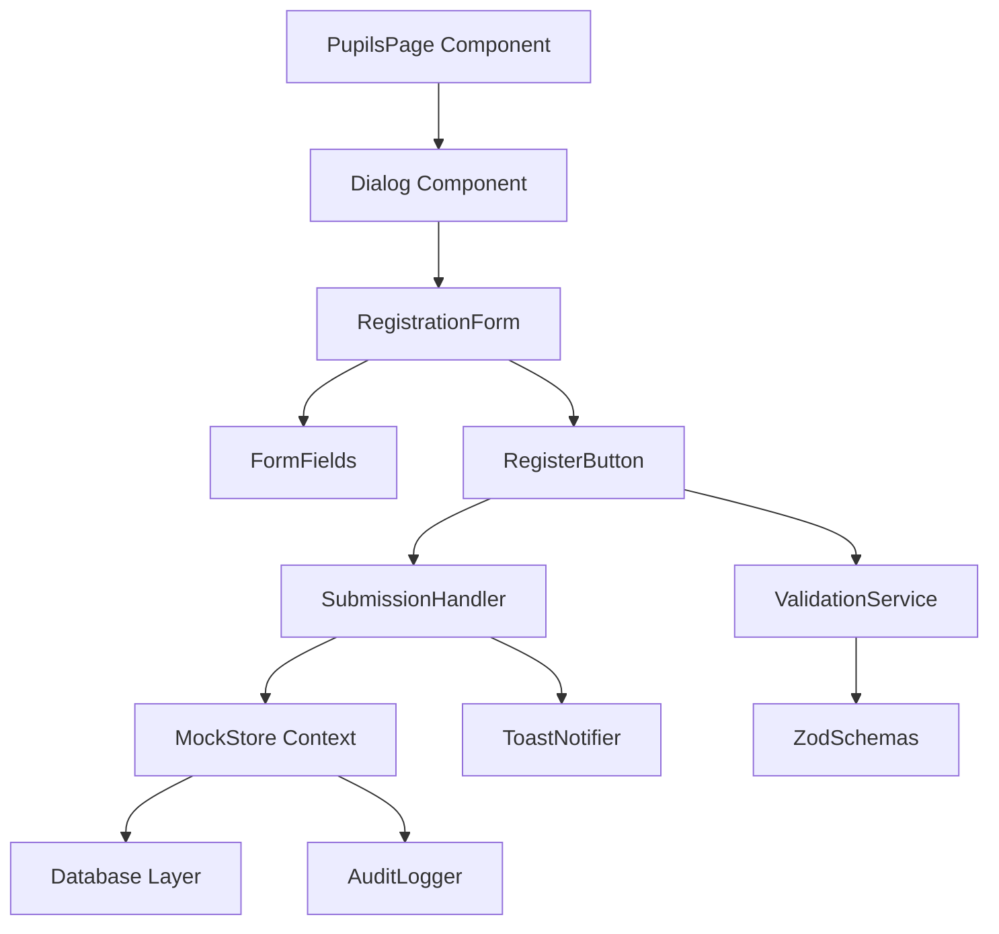
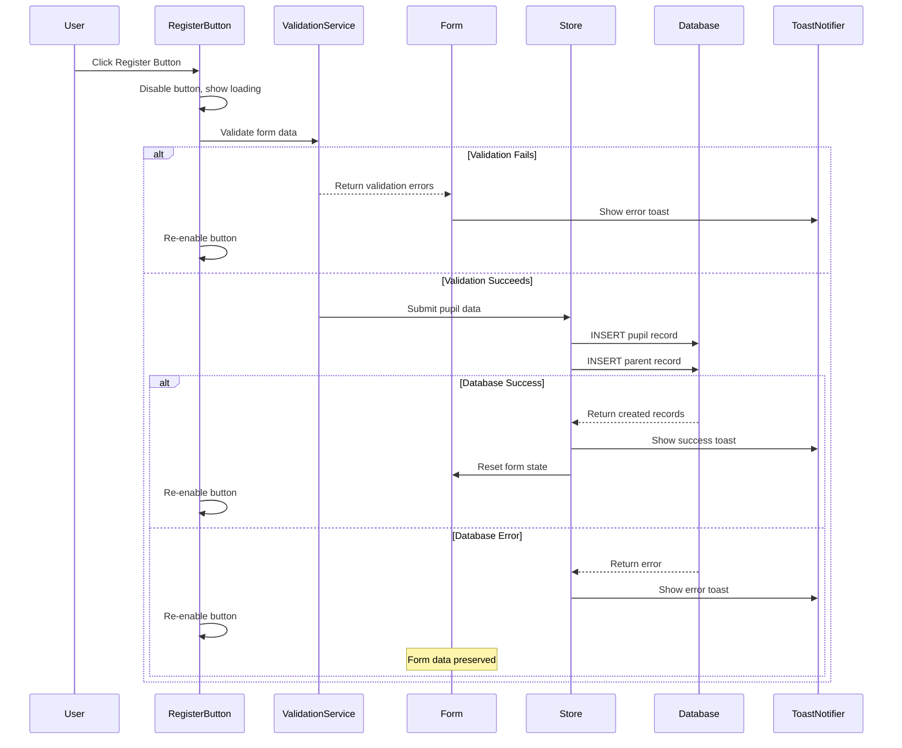
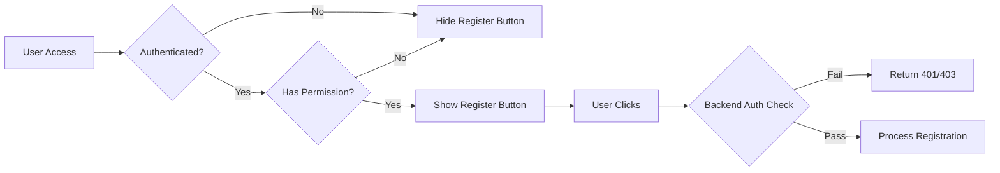

# Design Document: Pupil Registration Button

## Overview

The pupil registration button feature enables authorized users to submit the pupil registration form and persist new pupil records to the system database. This feature encompasses form validation, data persistence, error handling, access control, and user feedback mechanisms.

### Key Objectives

- Provide a clear, accessible submit mechanism for the pupil registration form
- Validate all form inputs before submission to ensure data integrity
- Persist pupil and parent/guardian information to the database
- Provide real-time feedback during submission (loading states, success/error messages)
- Enforce authentication and authorization requirements
- Maintain form state during errors to support retry without data loss
- Reset form state after successful submission to support multiple sequential registrations

### Technology Stack

- **Frontend Framework**: React 19 with TypeScript
- **Routing**: TanStack Router v1.168
- **UI Components**: Radix UI primitives with custom shadcn/ui components
- **Form Management**: React Hook Form v7.71 with Zod validation
- **State Management**: React Context (MockStoreProvider)
- **Data Persistence**: PostgreSQL via postgres driver v3.4
- **Styling**: Tailwind CSS v4.2
- **Notifications**: Sonner v2.0 for toast messages

## Architecture

### Component Architecture



### Data Flow



### Authentication & Authorization Flow



## Components and Interfaces

### 1. Register Button Component

**Location**: `src/routes/app.pupils.tsx` (within Dialog component)

**Props Interface**:

```typescript
interface RegisterButtonProps {
  onClick: () => void | Promise<void>;
  disabled?: boolean;
  loading?: boolean;
  label?: string;
}
```

**Responsibilities**:

- Render the primary action button with appropriate styling
- Display loading state during submission
- Manage disabled state based on form validity and submission status
- Trigger form validation and submission on click

**State Management**:

```typescript
const [isSubmitting, setIsSubmitting] = useState<boolean>(false);
const [isDisabled, setIsDisabled] = useState<boolean>(false);
```

### 2. Validation Service

**Location**: `src/lib/validation/pupil-registration.ts` (new file)

**Interface**:

```typescript
interface PupilFormData {
  admissionNo: string;
  firstName: string;
  lastName: string;
  gender: "M" | "F";
  dob: string;
  classId: string;
  parentName: string;
  parentPhone: string;
  parentEmail: string;
  parentRelationship: string;
}

interface ValidationResult {
  isValid: boolean;
  errors: Record<string, string>;
}

interface ValidationService {
  validateForm(data: PupilFormData, existingPupils: Pupil[]): ValidationResult;
  validateRequiredFields(data: PupilFormData): ValidationResult;
  validateAdmissionNumber(admissionNo: string, existingPupils: Pupil[]): ValidationResult;
  validateEmail(email: string): ValidationResult;
  validatePhoneNumber(phone: string): ValidationResult;
}
```

**Zod Schema**:

```typescript
import { z } from "zod";

const phoneRegex = /^\+?\d{10,15}$/;
const emailRegex = /^[^\s@]+@[^\s@]+\.[^\s@]+$/;

export const pupilRegistrationSchema = z.object({
  admissionNo: z.string().min(1, "Admission number is required"),
  firstName: z.string().min(1, "First name is required"),
  lastName: z.string().min(1, "Last name is required"),
  gender: z.enum(["M", "F"]),
  dob: z.string().min(1, "Date of birth is required"),
  classId: z.string().min(1, "Class is required"),
  parentName: z.string().min(1, "Parent/guardian name is required"),
  parentPhone: z.string().regex(phoneRegex, "Invalid phone number format"),
  parentEmail: z.string().regex(emailRegex, "Invalid email format"),
  parentRelationship: z.string().min(1, "Relationship is required"),
});

export type PupilRegistrationData = z.infer<typeof pupilRegistrationSchema>;
```

### 3. Submission Handler

**Location**: `src/lib/handlers/pupil-registration.ts` (new file)

**Interface**:

```typescript
interface SubmissionHandler {
  handleRegistration(
    formData: PupilFormData,
    store: MockStore,
    options: {
      onSuccess: () => void;
      onError: (error: Error) => void;
      onFinally: () => void;
    },
  ): Promise<void>;
}

interface RegistrationError extends Error {
  code: "VALIDATION_ERROR" | "DATABASE_ERROR" | "NETWORK_ERROR" | "AUTH_ERROR";
  details?: Record<string, any>;
}
```

### 4. Store Integration

**Existing Interface** (from mock-store.tsx):

```typescript
interface Store {
  addPupil(
    data: Omit<Pupil, "id" | "active"> & {
      parent?: Omit<Parent, "id">;
    },
  ): Promise<void>;
  currentUser: User | null;
  pupils: Pupil[];
  parents: Parent[];
  classes: ClassRoom[];
}
```

**Store Method Enhancement**:
The existing `addPupil` method will be utilized without modification. It already:

- Creates parent record if provided
- Creates pupil record with parent association
- Logs audit trail
- Updates local state
- Handles errors from database layer

### 5. Access Control Component

**Location**: Inline within `PupilsPage` component

**Interface**:

```typescript
interface AccessControl {
  canRegisterPupils(user: User | null): boolean;
}

const canRegisterPupils = (user: User | null): boolean => {
  if (!user) return false;

  const allowedRoles: Role[] = ["super_admin", "school_admin", "teacher"];
  return allowedRoles.includes(user.role) && user.status === "verified";
};
```

## Data Models

### Pupil Record

```typescript
interface Pupil {
  id: string; // Unique identifier (UUID)
  admissionNo: string; // Unique admission number
  firstName: string; // Pupil first name
  lastName: string; // Pupil last name
  gender: "M" | "F"; // Gender
  dob: string; // Date of birth (ISO 8601)
  classId: string; // Foreign key to ClassRoom
  parentIds: string[]; // Foreign keys to Parent records
  schoolId: string; // Foreign key to School
  active: boolean; // Active status (default: true)
}
```

### Parent/Guardian Record

```typescript
interface Parent {
  id: string; // Unique identifier (UUID)
  name: string; // Full name
  phone: string; // Phone number
  email: string; // Email address
  relationship: string; // Relationship to pupil (Mother/Father/Guardian)
  schoolId: string; // Foreign key to School
}
```

### Form State

```typescript
interface PupilRegistrationFormState {
  admissionNo: string;
  firstName: string;
  lastName: string;
  gender: "M" | "F";
  dob: string;
  classId: string;
  parentName: string;
  parentPhone: string;
  parentEmail: string;
  parentRelationship: string;
}

const defaultFormState: PupilRegistrationFormState = {
  admissionNo: "",
  firstName: "",
  lastName: "",
  gender: "M",
  dob: "",
  classId: "",
  parentName: "",
  parentPhone: "",
  parentEmail: "",
  parentRelationship: "Mother",
};
```

### Validation Error State

```typescript
interface ValidationErrors {
  [fieldName: string]: string;
}

// Example:
const validationErrors: ValidationErrors = {
  admissionNo: "Admission number already exists",
  parentEmail: "Invalid email format",
  parentPhone: "Invalid phone number format",
};
```

## Correctness Properties

_A property is a characteristic or behavior that should hold true across all valid executions of a system—essentially, a formal statement about what the system should do. Properties serve as the bridge between human-readable specifications and machine-verifiable correctness guarantees._

### Property 1: Required Field Validation Completeness

_For any_ pupil registration form submission, if any required field (admissionNo, firstName, lastName, dob, classId, parentName, parentPhone, parentEmail, parentRelationship) is empty or missing, the validation SHALL fail and return an error identifying all missing required fields.

**Validates: Requirements 2.1, 2.2**

### Property 2: Admission Number Uniqueness Validation

_For any_ admission number and list of existing pupils, if the admission number already exists in the system, the validation SHALL fail with an error message indicating the admission number is already in use, and if the admission number is unique, validation SHALL pass this check.

**Validates: Requirements 2.3, 2.4**

### Property 3: Email Format Validation

_For any_ string input in the parent email field, the validation SHALL correctly identify whether the string matches valid email format (contains @ symbol, has characters before and after @, has domain extension) and reject invalid formats with an appropriate error message.

**Validates: Requirements 2.5, 2.6**

### Property 4: Phone Number Format Validation

_For any_ string input in the parent phone field, the validation SHALL correctly identify whether the string matches valid phone number format (10-15 digits, optional + prefix, no letters or special characters except +) and reject invalid formats with an appropriate error message.

**Validates: Requirements 2.7, 2.8**

## Error Handling

### Error Categories

#### 1. Validation Errors

**Type**: User-correctable input errors  
**Handling Strategy**: Display field-specific error messages, keep form data intact, keep form open

**Examples**:

- Empty required fields
- Invalid email format
- Invalid phone format
- Duplicate admission number

**User Experience**:

```typescript
// Show error toast with general message
toast.error("Please correct the validation errors");

// Display field-specific errors inline
<Input
  error={errors.parentEmail}
  aria-invalid={!!errors.parentEmail}
/>
```

#### 2. Database Errors

**Type**: Backend persistence failures  
**Handling Strategy**: Display user-friendly error message, preserve form data, log detailed error server-side

**Examples**:

- Database connection failure
- Constraint violation
- Transaction timeout

**User Experience**:

```typescript
toast.error("Failed to save pupil record. Please try again.");
// Form data preserved for retry
```

**Error Logging**:

```typescript
console.error("[PupilRegistration] Database error:", {
  error: error.message,
  code: error.code,
  timestamp: new Date().toISOString(),
  userId: currentUser?.id,
  attemptedData: { admissionNo: form.admissionNo }, // Sanitized
});
```

#### 3. Network Errors

**Type**: Communication failures between client and server  
**Handling Strategy**: Display connectivity error message, preserve form data, suggest retry

**Examples**:

- Network timeout
- Server unreachable
- Request aborted

**User Experience**:

```typescript
toast.error("Connection problem. Please check your internet and try again.");
// Form data preserved for retry
```

#### 4. Authorization Errors

**Type**: Authentication or permission failures  
**Handling Strategy**: Display access denied message, redirect to login if unauthenticated

**Examples**:

- User not authenticated
- User lacks pupil registration permission
- Session expired

**User Experience**:

```typescript
// For unauthenticated
toast.error("Please log in to register pupils");
router.navigate({ to: "/login" });

// For unauthorized
toast.error("You don't have permission to register pupils");
```

### Error Recovery Patterns

#### Form State Preservation

```typescript
const [form, setForm] = useState<PupilRegistrationFormState>(defaultFormState);
const [preservedForm, setPreservedForm] = useState<PupilRegistrationFormState | null>(null);

const handleError = (error: RegistrationError) => {
  // Preserve current form state
  setPreservedForm(form);

  // Display error
  showErrorToast(error);

  // Re-enable submit button for retry
  setIsSubmitting(false);
};
```

#### Retry Logic

```typescript
const handleRetry = async () => {
  if (preservedForm) {
    setForm(preservedForm);
  }
  // User can modify and resubmit
};
```

## Testing Strategy

This feature requires a dual testing approach combining example-based tests for UI behavior and integration scenarios with property-based tests for validation logic.

### Unit Testing Strategy

**Testing Framework**: Vitest with React Testing Library  
**Coverage Target**: 80% line coverage for validation logic

#### Component Tests

**Register Button State Management** (Requirements 1.1-1.4, 4.1-4.3):

- Button renders with correct label
- Button positioned at form bottom
- Button displays primary styling
- Button disabled during submission
- Loading indicator displayed during async operation
- Button re-enabled after completion or error

**Form Reset Behavior** (Requirements 6.1-6.3):

- Form clears after successful submission
- All fields reset to default state
- Multiple sequential registrations supported

**Access Control** (Requirements 7.1-7.2):

- Button hidden for unauthenticated users
- Button hidden for users without permissions
- Button visible for authorized users

#### Validation Unit Tests

**Required Fields Validation** (Requirements 2.1-2.2):

- Empty admissionNo rejected
- Empty firstName rejected
- Empty lastName rejected
- Empty parentName rejected
- Empty parentPhone rejected
- Empty parentEmail rejected
- All required fields validation combined

**Error Message Tests**:

- Each validation error returns appropriate message
- Multiple errors reported together

### Property-Based Testing Strategy

**Testing Framework**: fast-check (JavaScript/TypeScript property-based testing library)  
**Configuration**: Minimum 100 iterations per property test  
**Integration**: Tests tagged with design property references

#### Property Test 1: Required Field Validation Completeness

**Feature: pupil-registration-button, Property 1: Required field validation SHALL identify all missing required fields**

```typescript
import fc from "fast-check";

describe("Property 1: Required Field Validation", () => {
  it("should reject forms with any required field missing", () => {
    fc.assert(
      fc.property(
        fc.record({
          admissionNo: fc.option(fc.string(), { nil: "" }),
          firstName: fc.option(fc.string(), { nil: "" }),
          lastName: fc.option(fc.string(), { nil: "" }),
          dob: fc.option(fc.string(), { nil: "" }),
          classId: fc.option(fc.string(), { nil: "" }),
          parentName: fc.option(fc.string(), { nil: "" }),
          parentPhone: fc.option(fc.string(), { nil: "" }),
          parentEmail: fc.option(fc.string(), { nil: "" }),
          parentRelationship: fc.option(fc.string(), { nil: "" }),
        }),
        (formData) => {
          const result = validateRequiredFields(formData);

          const hasEmptyField = Object.values(formData).some((v) => !v || v.trim() === "");

          if (hasEmptyField) {
            expect(result.isValid).toBe(false);
            expect(Object.keys(result.errors).length).toBeGreaterThan(0);
          }
        },
      ),
      { numRuns: 100 },
    );
  });
});
```

#### Property Test 2: Admission Number Uniqueness Validation

**Feature: pupil-registration-button, Property 2: Admission number uniqueness SHALL be correctly validated**

```typescript
describe("Property 2: Admission Number Uniqueness", () => {
  it("should detect duplicate admission numbers", () => {
    fc.assert(
      fc.property(
        fc.string({ minLength: 1, maxLength: 20 }),
        fc.array(
          fc.record({
            id: fc.uuid(),
            admissionNo: fc.string({ minLength: 1, maxLength: 20 }),
          }),
        ),
        (testAdmissionNo, existingPupils) => {
          const isDuplicate = existingPupils.some((p) => p.admissionNo === testAdmissionNo);
          const result = validateAdmissionNumber(testAdmissionNo, existingPupils);

          if (isDuplicate) {
            expect(result.isValid).toBe(false);
            expect(result.errors.admissionNo).toContain("already exists");
          } else {
            expect(result.isValid).toBe(true);
            expect(result.errors.admissionNo).toBeUndefined();
          }
        },
      ),
      { numRuns: 100 },
    );
  });
});
```

#### Property Test 3: Email Format Validation

**Feature: pupil-registration-button, Property 3: Email format validation SHALL correctly identify valid and invalid emails**

```typescript
describe("Property 3: Email Format Validation", () => {
  it("should validate email formats correctly", () => {
    fc.assert(
      fc.property(
        fc.oneof(
          fc.emailAddress(), // Valid emails
          fc.string(), // Random strings
          fc.constant(""), // Empty
          fc.constant("invalid@"), // Missing domain
          fc.constant("@invalid.com"), // Missing local part
          fc.constant("no-at-sign.com"), // No @ symbol
        ),
        (email) => {
          const result = validateEmail(email);
          const emailRegex = /^[^\s@]+@[^\s@]+\.[^\s@]+$/;
          const isValidFormat = emailRegex.test(email);

          if (isValidFormat) {
            expect(result.isValid).toBe(true);
          } else {
            expect(result.isValid).toBe(false);
            expect(result.errors.parentEmail).toBeDefined();
          }
        },
      ),
      { numRuns: 100 },
    );
  });
});
```

#### Property Test 4: Phone Number Format Validation

**Feature: pupil-registration-button, Property 4: Phone number format validation SHALL correctly identify valid and invalid phone numbers**

```typescript
describe("Property 4: Phone Number Format Validation", () => {
  it("should validate phone number formats correctly", () => {
    fc.assert(
      fc.property(
        fc.oneof(
          fc.stringMatching(/^\+?\d{10,15}$/), // Valid phones
          fc.string(), // Random strings
          fc.constant(""), // Empty
          fc.stringMatching(/^\d{1,9}$/), // Too short
          fc.stringMatching(/^\d{16,}$/), // Too long
          fc.stringMatching(/^[a-zA-Z]+$/), // Letters only
          fc.stringMatching(/^\d+ \d+$/), // With spaces
        ),
        (phone) => {
          const result = validatePhoneNumber(phone);
          const phoneRegex = /^\+?\d{10,15}$/;
          const isValidFormat = phoneRegex.test(phone);

          if (isValidFormat) {
            expect(result.isValid).toBe(true);
          } else {
            expect(result.isValid).toBe(false);
            expect(result.errors.parentPhone).toBeDefined();
          }
        },
      ),
      { numRuns: 100 },
    );
  });
});
```

### Integration Testing Strategy

**Testing Framework**: Vitest with MSW (Mock Service Worker) for API mocking

#### Database Integration Tests (Requirements 3.1-3.5)

**Successful Registration**:

- Test with 2-3 example pupils
- Verify pupil record created with all fields
- Verify parent record created and associated
- Verify unique ID assigned
- Verify success message displayed

**Database Error Handling** (Requirement 5.1):

- Mock database failure
- Verify error message displayed
- Verify form data preserved

**Network Error Handling** (Requirement 5.2):

- Mock network timeout
- Verify connection error message
- Verify form data preserved

#### Authorization Integration Tests (Requirements 7.3-7.4)

**Backend Auth Verification**:

- Test with authenticated, authorized user (success)
- Test with authenticated, unauthorized user (rejection)
- Test with unauthenticated user (rejection)
- Verify appropriate error responses

#### End-to-End Flow Tests

**Complete Registration Flow**:

1. Open form as authorized user
2. Fill all fields with valid data
3. Click register button
4. Verify loading state
5. Verify success message
6. Verify form reset
7. Verify new pupil in list

**Multiple Sequential Registrations** (Requirement 6.3):

1. Complete first registration
2. Immediately start second registration
3. Verify form is ready for new data
4. Complete second registration
5. Verify both pupils created

### Test Data Generation

**Valid Test Pupils**:

```typescript
const validPupilData: PupilFormData[] = [
  {
    admissionNo: "ADM001",
    firstName: "John",
    lastName: "Doe",
    gender: "M",
    dob: "2018-05-15",
    classId: "class-001",
    parentName: "Jane Doe",
    parentPhone: "+254712345678",
    parentEmail: "jane.doe@example.com",
    parentRelationship: "Mother",
  },
  // Additional examples...
];
```

**Invalid Test Cases**:

```typescript
const invalidEmailCases = ["plaintext", "@example.com", "user@", "user @example.com", ""];

const invalidPhoneCases = [
  "123", // Too short
  "abcdefghij", // Letters
  "+254 712 345 678", // Spaces
  "", // Empty
];
```

### Testing Execution

**Test Commands**:

```bash
# Run all tests
npm run test

# Run with coverage
npm run test -- --coverage

# Run property tests only
npm run test -- --grep "Property [0-9]"

# Run integration tests only
npm run test -- --grep "Integration"
```

**CI/CD Integration**:

- All tests run on pull request
- Property tests run with 100 iterations in CI
- Coverage reports generated and tracked
- Failed tests block merges

## Implementation Notes

### Library Selection: fast-check

**Rationale**: fast-check is the recommended property-based testing library for TypeScript/JavaScript projects. It provides:

- Comprehensive generator library (strings, numbers, emails, records, arrays)
- Shrinking capability to find minimal failing cases
- Good TypeScript support
- Active maintenance and community

**Installation**:

```bash
npm install --save-dev fast-check @types/fast-check
```

### Validation Implementation

The validation logic will be extracted into a separate validation service to:

- Enable easier property-based testing of pure functions
- Improve code reusability
- Separate concerns (validation vs UI state management)
- Support both client-side and server-side validation

### Existing Code Integration

The register button functionality is currently implemented inline within the `PupilsPage` component. The refactoring will:

1. Extract validation logic to `src/lib/validation/pupil-registration.ts`
2. Extract submission handler to `src/lib/handlers/pupil-registration.ts`
3. Maintain existing UI structure and user experience
4. Preserve existing mock store integration
5. Add property-based tests alongside existing tests

### Migration Path

1. **Phase 1**: Add validation service with property tests
2. **Phase 2**: Add submission handler with integration tests
3. **Phase 3**: Refactor existing component to use new services
4. **Phase 4**: Add comprehensive test coverage
5. **Phase 5**: Verify all requirements met
