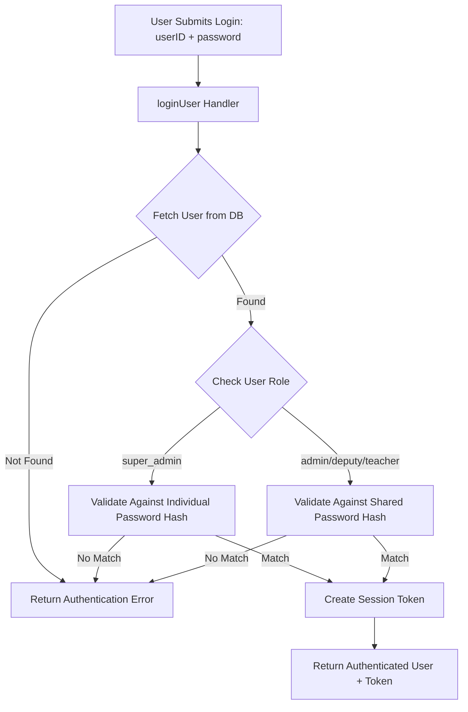
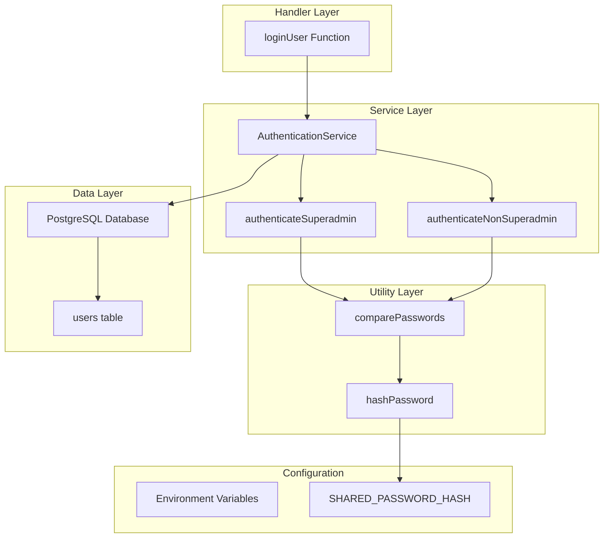

# Design Document: Shared Password Authentication

## Overview

This feature extends the existing Kindy Connect authentication system to support a dual-password mechanism: individual passwords for superadmin users and a shared password for all other user roles (teachers, school admins, deputies). This design maintains the current user identification system while introducing role-based password validation.

### Current System State

The existing system has:

- A `users` table with fields: `id`, `name`, `email`, `role`, `status`, `phone`, `class_id`, `registered_at`, `password`, `school_id`, `subjects`
- Role types: `super_admin`, `admin`, `deputy`, `teacher`
- A `loginUser` function that validates user ID but does not implement password verification
- No password hashing or secure comparison mechanisms

### Design Goals

1. **Minimal Disruption**: Extend the existing authentication without breaking current functionality
2. **Security First**: Implement industry-standard password hashing and timing-safe comparison
3. **Role-Based Logic**: Route authentication through different paths based on user role
4. **Maintainability**: Clear separation of concerns between authentication components

### Key Design Decisions

**Decision 1: Password Hashing Algorithm**

- **Choice**: bcrypt with work factor 12
- **Rationale**: bcrypt is widely adopted, well-supported in Node.js ecosystem, and recommended by OWASP for password storage. While Argon2id is the current OWASP first choice, bcrypt with appropriate work factor provides sufficient security and has broader ecosystem support. Work factor 12 balances security against computational cost.
- **Source**: [OWASP Password Storage Cheat Sheet](https://shattered.io/bcrypt-password-hashing-nodejs/)

**Decision 2: Timing Attack Protection**

- **Choice**: Use Node.js native `crypto.timingSafeEqual()` for password hash comparison
- **Rationale**: Prevents timing attacks where attackers measure response times to deduce password information character-by-character
- **Source**: [Node.js Crypto Documentation](https://github.com/simonw/til/blob/main/node/constant-time-compare-strings.md)

**Decision 3: Shared Password Storage**

- **Choice**: Store shared password hash in environment variable (`SHARED_PASSWORD_HASH`)
- **Rationale**: Allows runtime updates without database migration, keeps sensitive config separate from code, supports environment-specific passwords

**Decision 4: Database Schema**

- **Choice**: Use existing `password` column, no migration needed
- **Rationale**: Current schema already supports password storage per user; superadmins use their individual password, non-superadmins' password field will be ignored in favor of shared password

## Architecture

### High-Level Flow



### Component Architecture

The design follows a layered architecture:

1. **Handler Layer**: `loginUser` function - receives authentication requests
2. **Service Layer**: `AuthenticationService` - contains authentication logic
3. **Utility Layer**: Password hashing and comparison utilities
4. **Configuration Layer**: Environment-based password configuration



## Components and Interfaces

### 1. Password Utilities Module (`src/lib/auth/password-utils.ts`)

**Purpose**: Provides password hashing and secure comparison functions.

**Interface**:

```typescript
/**
 * Hash a plaintext password using bcrypt with work factor 12
 * @param password - Plaintext password to hash
 * @returns Promise resolving to hashed password string
 */
export async function hashPassword(password: string): Promise<string>;

/**
 * Compare a plaintext password against a hash using timing-safe comparison
 * @param password - Plaintext password to verify
 * @param hash - Stored bcrypt hash
 * @returns Promise resolving to true if passwords match, false otherwise
 */
export async function comparePasswords(password: string, hash: string): Promise<boolean>;
```

**Implementation Notes**:

- Uses `bcrypt` library for hashing with cost factor 12
- `comparePasswords` internally uses `bcrypt.compare()` which handles timing-safe comparison
- Handles edge cases: empty strings, null/undefined values return false

**Dependencies**:

- `bcrypt` npm package (v5.x or later)

---

### 2. Authentication Service Module (`src/lib/auth/auth-service.ts`)

**Purpose**: Centralizes authentication logic with role-based password validation.

**Interface**:

```typescript
export interface AuthenticationResult {
  success: boolean;
  user?: User;
  sessionToken?: string;
  error?: string;
}

/**
 * Authenticate a user based on their role
 * @param userId - User identifier
 * @param password - Plaintext password
 * @returns Authentication result with user data or error
 */
export async function authenticate(userId: string, password: string): Promise<AuthenticationResult>;
```

**Internal Functions**:

```typescript
/**
 * Authenticate superadmin using individual password
 */
async function authenticateSuperadmin(user: User, password: string): Promise<boolean>;

/**
 * Authenticate non-superadmin using shared password
 */
async function authenticateNonSuperadmin(user: User, password: string): Promise<boolean>;

/**
 * Create session token for authenticated user
 */
function createSessionToken(user: User): string;
```

**Authentication Flow Logic**:

```typescript
// Pseudocode for authenticate function
async function authenticate(userId: string, password: string) {
  // 1. Fetch user from database
  const user = await fetchUserById(userId);
  if (!user) {
    return { success: false, error: "Authentication failed" };
  }

  // 2. Route based on role
  let isValid: boolean;
  if (user.role === "super_admin") {
    isValid = await authenticateSuperadmin(user, password);
  } else {
    isValid = await authenticateNonSuperadmin(user, password);
  }

  // 3. Return result
  if (!isValid) {
    return { success: false, error: "Authentication failed" };
  }

  // 4. Create session
  const sessionToken = createSessionToken(user);
  return { success: true, user, sessionToken };
}
```

---

### 3. Configuration Module (`src/lib/auth/config.ts`)

**Purpose**: Manages authentication configuration from environment variables.

**Interface**:

```typescript
/**
 * Get the shared password hash from environment
 * @throws Error if SHARED_PASSWORD_HASH is not set
 */
export function getSharedPasswordHash(): string;

/**
 * Get session expiration time in milliseconds (8 hours)
 */
export function getSessionExpirationMs(): number;
```

**Environment Variables**:

- `SHARED_PASSWORD_HASH`: bcrypt hash of the shared password (required)
- `SESSION_EXPIRATION_HOURS`: Session duration (default: 8)

---

### 4. Modified loginUser Handler (`src/lib/db-functions.ts`)

**Current Implementation**:

```typescript
export const loginUser = createServerFn({ method: "POST" })
  .validator((d: { id: string }) => d)
  .handler(async ({ data }) => {
    const { id } = data;
    const results = await sql`SELECT * FROM users WHERE id = ${id}`;
    if (results.length === 0) return null;
    const user = toCamel<User>(results[0]);
    if (user.role === "teacher" && user.status !== "verified") return null;
    return user;
  });
```

**New Implementation**:

```typescript
export const loginUser = createServerFn({ method: "POST" })
  .validator((d: { id: string; password: string }) => d)
  .handler(async ({ data }) => {
    const { id, password } = data;

    // Delegate to authentication service
    const result = await authenticate(id, password);

    if (!result.success) {
      return null; // Maintain current error handling pattern
    }

    // Additional verification for teachers
    if (result.user.role === "teacher" && result.user.status !== "verified") {
      return null;
    }

    return result.user;
  });
```

## Data Models

### User Model (Existing - No Changes)

```typescript
export interface User {
  id: string;
  name: string;
  email: string;
  role: "super_admin" | "admin" | "deputy" | "teacher";
  status: "pending" | "verified" | "rejected";
  phone?: string;
  classId?: string;
  registeredAt: string;
  password?: string; // Used for superadmins, ignored for others
  schoolId?: string;
  subjects?: string[];
}
```

**Database Schema** (Existing - No Migration Required):

```sql
CREATE TABLE users (
    id VARCHAR(50) PRIMARY KEY,
    name VARCHAR(255) NOT NULL,
    email VARCHAR(255) NOT NULL UNIQUE,
    role VARCHAR(50) NOT NULL CHECK (role IN ('super_admin', 'admin', 'deputy', 'teacher')),
    status VARCHAR(50) NOT NULL DEFAULT 'pending' CHECK (status IN ('pending', 'verified', 'rejected')),
    phone VARCHAR(50) UNIQUE,
    class_id VARCHAR(50),
    registered_at DATE NOT NULL DEFAULT CURRENT_DATE,
    password VARCHAR(255) NOT NULL,
    school_id VARCHAR(50),
    subjects TEXT[]
);
```

**Usage Notes**:

- For `super_admin` role: `password` field contains individual bcrypt hash
- For `admin`, `deputy`, `teacher` roles: `password` field is ignored (can be set to any value or empty string)
- User identification always uses `id` field regardless of role

---

### Authentication Request Model

```typescript
export interface AuthenticationRequest {
  userId: string;
  password: string;
}
```

---

### Authentication Result Model

```typescript
export interface AuthenticationResult {
  success: boolean;
  user?: User;
  sessionToken?: string;
  error?: string;
}
```

**Field Descriptions**:

- `success`: Boolean indicating authentication outcome
- `user`: Full user object if authentication succeeds
- `sessionToken`: JWT or session identifier for authenticated session
- `error`: Generic error message (never reveals specific failure reason)

---

### Session Token Model

```typescript
export interface SessionToken {
  userId: string;
  userRole: string;
  issuedAt: number; // Unix timestamp
  expiresAt: number; // Unix timestamp (issuedAt + 8 hours)
}
```

**Implementation**: JWT signed with `VITE_AUTH_SECRET` environment variable

## Correctness Properties

_A property is a characteristic or behavior that should hold true across all valid executions of a system—essentially, a formal statement about what the system should do. Properties serve as the bridge between human-readable specifications and machine-verifiable correctness guarantees._

### Property 1: Superadmin Individual Password Validation

_For any_ superadmin user with a stored individual password hash, when that user submits an authentication request, the system SHALL validate the provided password against that user's individual password hash stored in the database.

**Validates: Requirements 1.1**

---

### Property 2: Incorrect Password Rejection

_For any_ user of any role, when that user submits an authentication request with a password that does not match their expected password (individual for superadmin, shared for others), the system SHALL reject the authentication request and return an authentication failure.

**Validates: Requirements 1.2, 2.2**

---

### Property 3: Non-Superadmin Shared Password Validation

_For any_ user with role admin, deputy, or teacher, when that user submits an authentication request, the system SHALL validate the provided password against the shared password hash (from environment configuration), not against the password field stored in their user record.

**Validates: Requirements 2.1**

---

### Property 4: Unique User Identification with Shared Password

_For any_ two distinct non-superadmin users who both authenticate successfully using the shared password, their resulting session tokens SHALL contain their respective unique user IDs, maintaining individual user identification despite shared password usage.

**Validates: Requirements 2.4**

---

### Property 5: Role-Based Authentication Routing

_For any_ authentication request, the system SHALL retrieve the user's role from the database and route the authentication through the correct validation path: individual password validation for super_admin role, shared password validation for admin, deputy, or teacher roles.

**Validates: Requirements 3.1, 3.3, 3.4**

---

### Property 6: Invalid User Rejection

_For any_ user ID that does not exist in the database, when an authentication request is submitted with that ID, the system SHALL reject the request and return an authentication failure.

**Validates: Requirements 3.2**

---

### Property 7: Password Hash Format Validation

_For any_ plaintext password processed by the hashPassword function, the output SHALL be a valid bcrypt hash string with the correct format (starting with $2a$ or $2b$ and containing the expected structure of cost factor, salt, and hash).

**Validates: Requirements 4.2**

### Property 8: Generic Error Messages

_For any_ authentication failure scenario (incorrect password, non-existent user, wrong role, or any other failure condition), the system SHALL return the same generic "Authentication failed" error message without revealing whether the user ID exists, whether the password was incorrect, or what the user's role is.

**Validates: Requirements 5.1, 5.2, 5.4**

---

### Property 9: Authentication Failure Audit Logging

_For any_ authentication failure, the system SHALL log an audit entry containing the attempted user ID, timestamp of the attempt, and the specific error type (for internal tracking), while returning only generic error messages to the client.

**Validates: Requirements 5.3**

---

### Property 10: Session Token Content

_For any_ successful authentication (regardless of user role), the system SHALL create and return a session token that contains the authenticated user's ID and role.

**Validates: Requirements 1.3, 2.3, 6.1, 6.3**

---

### Property 11: Session Expiration Calculation

_For any_ session token created at time T, the session expiration time SHALL be exactly T + 8 hours (28,800,000 milliseconds), ensuring consistent session duration across all users.

**Validates: Requirements 6.2**

---

### Property 12: Password Comparison Round-Trip

_For any_ plaintext password P, when hashed to produce hash H, comparing P against H SHALL return true, and comparing any different password P' against H SHALL return false (assuming P' is not identical to P).

**Validates: Requirements 1.1, 2.1, 4.4** (implicit - validates hash/compare cycle works correctly)

---

### Property 13: Backward Compatibility for Existing Superadmins

_For any_ superadmin user that existed before this feature deployment with an existing password hash, authentication with their original password SHALL succeed without requiring password reset or modification.

**Validates: Requirements 7.2, 7.3**

## Error Handling

### Error Categories

1. **Invalid Credentials**: User ID not found, wrong password
2. **Configuration Errors**: Missing SHARED_PASSWORD_HASH environment variable
3. **Database Errors**: Connection failures, query errors
4. **Hashing Errors**: bcrypt failures, invalid hash formats
5. **Session Creation Errors**: Token generation failures

### Error Handling Strategy

**Principle**: Security-first error handling that prevents information leakage while maintaining system observability through logging.

### Error Responses

All authentication errors return the same generic message to clients:

```typescript
{
  success: false,
  error: "Authentication failed"
}
```

**Rationale**: Prevents user enumeration attacks where attackers could determine valid user IDs by observing different error messages.

### Internal Error Logging

While client responses are generic, internal logs capture specific details:

```typescript
// Example audit log entry
{
  timestamp: "2024-01-15T10:30:00Z",
  event: "authentication_failure",
  userId: "user123",
  reason: "incorrect_password",
  role: "teacher",
  ipAddress: "192.168.1.100"
}
```

### Configuration Error Handling

**Missing SHARED_PASSWORD_HASH**:

- System fails fast at startup
- Throws error: "SHARED_PASSWORD_HASH environment variable is required"
- Prevents application from starting in misconfigured state

**Invalid Hash Format**:

- Detected when first authentication attempt is made
- Logged as critical error
- Returns generic authentication failure to client

### Database Error Handling

**Connection Failures**:

- Retry logic: 3 attempts with exponential backoff
- If all retries fail, return generic authentication error
- Log detailed connection error for operations team

**Query Errors**:

- Catch and log SQL errors
- Return generic authentication failure
- Alert on repeated query failures (possible SQL injection attempts)

### Timing Attack Prevention

**Constant-Time Operations**:

- Use `bcrypt.compare()` for all password comparisons (built-in timing safety)
- Ensure failed authentication path takes similar time as successful path
- Add small random delay (10-50ms) to both success and failure responses to prevent timing-based user enumeration

### Password Hashing Error Handling

**Hashing Failures**:

```typescript
try {
  const hash = await hashPassword(password);
  return hash;
} catch (error) {
  logger.error("Password hashing failed", { error });
  throw new Error("Unable to process password");
}
```

**Invalid Hash Detection**:

```typescript
try {
  const isValid = await comparePasswords(password, hash);
  return isValid;
} catch (error) {
  // Invalid hash format or bcrypt error
  logger.error("Password comparison failed", { error, userId });
  return false; // Treat as authentication failure
}
```

### Session Error Handling

**Token Generation Failures**:

- Log error with user context
- Return authentication success but with warning flag
- Client can retry session creation

**Session Storage Failures**:

- Depends on session storage mechanism (JWT requires no storage)
- For server-side sessions: retry storage, fall back to in-memory

### Error Recovery Patterns

**Transient Errors** (database connection issues):

- Implement retry with exponential backoff
- Maximum 3 retry attempts
- If all retries fail, return error and alert operations

**Permanent Errors** (configuration issues):

- Fail fast at application startup
- Prevent system from serving requests in misconfigured state
- Require manual intervention to resolve

**Graceful Degradation**:

- If audit logging fails, authentication should still proceed
- Log error to stdout/stderr as fallback
- Alert operations team about logging system failure

## Testing Strategy

### Overview

This feature employs a dual testing approach combining property-based testing (PBT) for universal behavioral guarantees with unit testing for specific examples and edge cases. PBT is well-suited for this feature because the authentication logic involves pure functions with clear input/output behavior and universal properties that should hold across all inputs.

### Property-Based Testing

**Framework**: fast-check (JavaScript/TypeScript property-based testing library)

**Test Configuration**:

- Minimum 100 iterations per property test
- Each test references its corresponding design property
- Tag format: `Feature: shared-password-authentication, Property N: [property text]`

**Property Test Specifications**:

#### Property 1: Superadmin Individual Password Validation

```typescript
// Feature: shared-password-authentication, Property 1: Superadmin Individual Password Validation
// For any superadmin user with stored individual password hash, validate against that hash

Generators:
- Arbitrary superadmin user (random id, name, email, role: "super_admin")
- Arbitrary password string (length 8-72, various characters)

Test:
1. Generate random superadmin user and password
2. Hash the password and store as user's individual password
3. Call authenticate(userId, password)
4. Assert: result.success === true
5. Assert: system validated against user's individual hash (not shared password)
```

#### Property 2: Incorrect Password Rejection

```typescript
// Feature: shared-password-authentication, Property 2: Incorrect Password Rejection

Generators:
- Arbitrary user (any role)
- Arbitrary correct password
- Arbitrary incorrect password (different from correct password)

Test:
1. Generate user with correct password
2. Generate incorrect password (ensure != correct password)
3. Call authenticate(userId, incorrectPassword)
4. Assert: result.success === false
5. Assert: result.error === "Authentication failed"
```

#### Property 3: Non-Superadmin Shared Password Validation

```typescript
// Feature: shared-password-authentication, Property 3: Non-Superadmin Shared Password Validation

Generators:
- Arbitrary non-superadmin user (role: "admin" | "deputy" | "teacher")
- Arbitrary individual password (stored in user record, should be ignored)
- Shared password from config

Test:
1. Generate non-superadmin user with individual password in DB
2. Set shared password in config
3. Call authenticate(userId, sharedPassword)
4. Assert: result.success === true
5. Verify system used shared password, not user's individual password field
```

#### Property 4: Unique User Identification with Shared Password

```typescript
// Feature: shared-password-authentication, Property 4: Unique User Identification

Generators:
- Two arbitrary distinct non-superadmin users (different user IDs)
- Shared password

Test:
1. Generate two distinct non-superadmin users
2. Authenticate both with shared password
3. Assert: both authentications succeed
4. Assert: session1.userId !== session2.userId
5. Assert: each session contains correct individual userId
```

#### Property 5: Role-Based Authentication Routing

```typescript
// Feature: shared-password-authentication, Property 5: Role-Based Authentication Routing

Generators:
- Arbitrary user with random role (super_admin | admin | deputy | teacher)

Test:
1. Generate user with random role
2. Call authenticate with appropriate password
3. Assert: system retrieved user's role from database
4. Assert: routed to correct validation path based on role
   - super_admin -> individual password validation
   - others -> shared password validation
```

#### Property 6: Invalid User Rejection

```typescript
// Feature: shared-password-authentication, Property 6: Invalid User Rejection

Generators:
- Arbitrary non-existent user ID (not in database)
- Arbitrary password

Test:
1. Generate random user ID that doesn't exist
2. Call authenticate(nonExistentUserId, randomPassword)
3. Assert: result.success === false
4. Assert: result.error === "Authentication failed"
```

#### Property 7: Password Hash Format Validation

```typescript
// Feature: shared-password-authentication, Property 7: Password Hash Format

Generators:
- Arbitrary plaintext password (length 8-72)

Test:
1. Generate random plaintext password
2. Call hashPassword(password)
3. Assert: output matches bcrypt hash format regex: /^\$2[aby]\$\d{2}\$.{53}$/
4. Assert: hash starts with $2a$ or $2b$
5. Assert: hash contains cost factor, salt, and hash components
```

#### Property 8: Generic Error Messages

```typescript
// Feature: shared-password-authentication, Property 8: Generic Error Messages

Generators:
- Arbitrary failure scenario:
  - Non-existent user ID
  - Incorrect password for existing user
  - Invalid role (if applicable)

Test:
1. Generate various failure scenarios
2. Call authenticate for each scenario
3. Assert: all failures return same error message: "Authentication failed"
4. Assert: error message contains no user-specific information
5. Assert: error message contains no role information
```

#### Property 9: Authentication Failure Audit Logging

```typescript
// Feature: shared-password-authentication, Property 9: Audit Logging

Generators:
- Arbitrary user ID
- Arbitrary incorrect password

Test (with mock logger):
1. Generate authentication failure scenario
2. Call authenticate(userId, incorrectPassword)
3. Assert: logger was called with audit entry
4. Assert: log entry contains userId, timestamp, error type
5. Assert: client receives only generic error message
```

#### Property 10: Session Token Content

```typescript
// Feature: shared-password-authentication, Property 10: Session Token Content

Generators:
- Arbitrary user (any role)
- Correct password for that user

Test:
1. Generate random user with correct password
2. Call authenticate successfully
3. Assert: result.sessionToken exists
4. Decode session token
5. Assert: token contains userId matching authenticated user
6. Assert: token contains userRole matching user's role
```

#### Property 11: Session Expiration Calculation

```typescript
// Feature: shared-password-authentication, Property 11: Session Expiration

Generators:
- Arbitrary authentication timestamp

Test:
1. Generate random authentication time T
2. Create session token at time T
3. Decode token
4. Assert: token.expiresAt === token.issuedAt + (8 * 60 * 60 * 1000)
5. Assert: expiration is exactly 8 hours from issuance
```

#### Property 12: Password Comparison Round-Trip

```typescript
// Feature: shared-password-authentication, Property 12: Round-Trip Validation

Generators:
- Arbitrary plaintext password P
- Arbitrary different password P' (P' !== P)

Test:
1. Generate random password P
2. Hash P to produce H
3. Assert: comparePasswords(P, H) === true
4. Generate different password P'
5. Assert: comparePasswords(P', H) === false
```

#### Property 13: Backward Compatibility

```typescript
// Feature: shared-password-authentication, Property 13: Backward Compatibility

Generators:
- Arbitrary superadmin user with pre-existing password hash

Test:
1. Create superadmin user with existing bcrypt hash (simulating pre-deployment state)
2. Call authenticate with original password
3. Assert: authentication succeeds without modification
4. Assert: no password reset required
5. Assert: user's password hash unchanged after authentication
```

### Unit Testing

**Purpose**: Test specific examples, edge cases, and integration points that complement property-based tests.

**Test Cases**:

1. **Edge Case: Empty Password**
   - Input: userId: "user123", password: ""
   - Expected: Authentication fails with generic error
   - Validates: Input validation

2. **Edge Case: Extremely Long Password**
   - Input: password with 73+ characters (bcrypt limit is 72)
   - Expected: Only first 72 characters are used, authentication succeeds if correct
   - Validates: bcrypt limitation handling

3. **Edge Case: Special Characters in Password**
   - Input: password containing unicode, emoji, special characters
   - Expected: Authentication succeeds if password matches hash
   - Validates: Character encoding handling

4. **Example: Typical Superadmin Login**
   - Input: super_admin user with password "SecurePass123!"
   - Expected: Authentication succeeds, session contains correct userId and role
   - Validates: Happy path for superadmin

5. **Example: Typical Teacher Login**
   - Input: teacher user with shared password
   - Expected: Authentication succeeds, session contains teacher's userId
   - Validates: Happy path for non-superadmin

6. **Example: Concurrent Non-Superadmin Logins**
   - Input: Multiple teachers login simultaneously with shared password
   - Expected: All authentications succeed with unique session tokens
   - Validates: Concurrency handling

7. **Error Case: Database Connection Failure**
   - Setup: Mock database to throw connection error
   - Expected: Generic authentication error, internal error logged
   - Validates: Database error handling

8. **Error Case: Invalid bcrypt Hash Format**
   - Setup: Store malformed hash in database
   - Expected: Authentication fails gracefully, error logged
   - Validates: Hash format validation

9. **Integration: Session Token JWT Structure**
   - Action: Authenticate successfully
   - Validation: Decode JWT, verify header, payload, signature
   - Validates: JWT implementation correctness

10. **Integration: Environment Variable Loading**
    - Setup: Set SHARED_PASSWORD_HASH in environment
    - Validation: System reads and uses correct hash
    - Validates: Configuration loading

### Integration Testing

**Scenarios**:

1. **End-to-End Authentication Flow**
   - Create user → Attempt login → Verify session → Access protected resource
   - Validates: Complete authentication and authorization chain

2. **Shared Password Update**
   - Update SHARED_PASSWORD_HASH → Restart or reload config → Verify new password works
   - Validates: Configuration update mechanism (Requirement 4.3)

3. **Database Migration Compatibility**
   - Run feature deployment on database with existing users
   - Verify existing superadmins can still login
   - Validates: Backward compatibility (Requirement 7.1, 7.2)

4. **Timing Attack Resistance** (basic validation)
   - Measure response times for correct vs incorrect passwords
   - Expected: No significant timing difference that could leak information
   - Note: This is a sanity check; true timing attack resistance is provided by bcrypt library

### Test Environment Setup

**Dependencies**:

- `fast-check`: Property-based testing framework
- `bcrypt`: Password hashing (v5.x or later)
- `jsonwebtoken`: JWT session tokens
- `jest` or `vitest`: Test runner
- Mock database for isolated testing

**Configuration**:

```typescript
// test-config.ts
export const TEST_CONFIG = {
  sharedPasswordHash: await hashPassword("test-shared-password"),
  sessionExpirationMs: 8 * 60 * 60 * 1000,
  bcryptRounds: 12,
};
```

### Coverage Goals

- **Property Tests**: Cover all 13 correctness properties
- **Unit Tests**: 90%+ code coverage on authentication module
- **Integration Tests**: Cover all major integration points
- **Edge Cases**: All identified edge cases in unit tests

### Continuous Testing

- Run property tests with 100 iterations in CI/CD
- Run full unit test suite on every commit
- Run integration tests before deployment
- Performance tests to monitor authentication latency

## Security Considerations

### Password Storage

**Individual Passwords (Superadmins)**:

- Stored as bcrypt hashes in database `users.password` field
- Cost factor: 12 (balances security and performance)
- Each password has unique salt (handled automatically by bcrypt)
- Never store plaintext passwords in logs or database

**Shared Password (Non-Superadmins)**:

- Stored as bcrypt hash in `SHARED_PASSWORD_HASH` environment variable
- Same cost factor: 12
- Environment variable should be set via secure configuration management
- Rotate shared password periodically (e.g., quarterly)

### Information Leakage Prevention

**Generic Error Messages**:

- All authentication failures return identical error message
- Prevents user enumeration attacks
- Prevents role disclosure through error messages

**Timing Attack Prevention**:

- Use `bcrypt.compare()` which provides constant-time comparison
- Add small random delay (10-50ms) to both success and failure responses
- Prevents attackers from timing responses to guess valid userIds

**Audit Logging Security**:

- Log authentication failures for security monitoring
- Ensure logs are protected and access-controlled
- Include rate-limiting data to detect brute-force attempts
- Never log plaintext passwords

### Rate Limiting

**Recommendation**: Implement rate limiting to prevent brute-force attacks:

- Limit: 5 failed attempts per user ID per 15 minutes
- Action: Temporarily block authentication attempts for that user ID
- Alert: Notify security team after 10+ failed attempts from same IP
- Implementation: Can be added as middleware before authentication handler

### Session Security

**JWT Tokens**:

- Sign with strong secret (`VITE_AUTH_SECRET` environment variable)
- Use HS256 algorithm minimum (or RS256 for better security)
- Include expiration claim (8 hours)
- Consider adding issued-at claim and token ID for revocation support

**Session Management**:

- Tokens should be stored securely on client (httpOnly cookies recommended)
- Implement token refresh mechanism for long-lived sessions
- Consider token revocation list for logged-out sessions

### Password Complexity Requirements

**Superadmin Passwords**:

- Minimum length: 12 characters
- Require: uppercase, lowercase, numbers, special characters
- Enforce at user creation and password change

**Shared Password**:

- Minimum length: 16 characters (more users = higher risk)
- Same complexity requirements as superadmin
- Document password rotation schedule

### Secure Configuration Management

**Environment Variables**:

- Never commit `.env` files to version control
- Use secrets management system in production (e.g., AWS Secrets Manager, Azure Key Vault)
- Restrict access to environment configuration
- Audit configuration changes

### Encryption in Transit

**HTTPS Requirement**:

- All authentication requests must be over HTTPS
- Prevents password interception during transmission
- Enforce in production with HSTS headers

### SQL Injection Prevention

**Parameterized Queries**:

- Current code uses template literals correctly: `sql\`SELECT \* FROM users WHERE id = ${id}\``
- Continue using parameterized queries for all database operations
- Never concatenate user input into SQL strings

### Defense in Depth

**Multiple Security Layers**:

1. HTTPS for encryption in transit
2. bcrypt for secure password storage
3. Timing-safe comparison to prevent timing attacks
4. Generic error messages to prevent information leakage
5. Rate limiting to prevent brute-force attacks
6. Audit logging for security monitoring
7. Session expiration for limited exposure window

## Implementation Considerations

### Dependencies

**New Dependencies to Install**:

```json
{
  "dependencies": {
    "bcrypt": "^5.1.1",
    "jsonwebtoken": "^9.0.2"
  },
  "devDependencies": {
    "@types/bcrypt": "^5.0.2",
    "@types/jsonwebtoken": "^9.0.5",
    "fast-check": "^3.15.0"
  }
}
```

### File Structure

```
src/lib/auth/
├── password-utils.ts       # Password hashing and comparison
├── auth-service.ts         # Core authentication logic
├── config.ts              # Configuration management
├── session.ts             # Session token creation
└── __tests__/
    ├── password-utils.test.ts
    ├── auth-service.test.ts
    ├── auth.properties.test.ts  # Property-based tests
    └── integration.test.ts
```

### Database Considerations

**No Migration Required**: The existing `users` table already has a `password` column that can accommodate this feature.

**Existing Schema Utilization**:

- `super_admin` users: `password` field contains individual bcrypt hash
- `admin`, `deputy`, `teacher` users: `password` field can remain as-is (will be ignored)

**Optional Future Optimization**: Could add a nullable `password` column and NULL out non-superadmin passwords to clarify intent, but not required for functionality.

### Environment Configuration

**Required Environment Variables**:

```bash
# Shared password hash (bcrypt hash of the shared password)
SHARED_PASSWORD_HASH=$2b$12$abcdefghijklmnopqrstuvwxyz1234567890ABCDEFG

# Session secret for JWT signing
VITE_AUTH_SECRET=your-secure-random-secret-key-here

# Optional: Session expiration in hours (default: 8)
SESSION_EXPIRATION_HOURS=8
```

**Generating Shared Password Hash**:

```typescript
// One-time script to generate hash
import bcrypt from "bcrypt";

const sharedPassword = "YourSharedPasswordHere";
const hash = await bcrypt.hash(sharedPassword, 12);
console.log("SHARED_PASSWORD_HASH=" + hash);
```

### Deployment Steps

1. **Pre-Deployment**:
   - Generate bcrypt hash for shared password
   - Set `SHARED_PASSWORD_HASH` in production environment
   - Verify `VITE_AUTH_SECRET` is set for JWT signing
   - Ensure all existing superadmin passwords are already hashed with bcrypt

2. **Deployment**:
   - Install new npm dependencies (`bcrypt`, `jsonwebtoken`)
   - Deploy authentication modules to production
   - Update `loginUser` handler to include password parameter

3. **Post-Deployment**:
   - Test superadmin login with existing passwords
   - Test non-superadmin login with shared password
   - Monitor authentication logs for errors
   - Verify no increase in authentication latency

4. **Rollback Plan**:
   - If issues arise, revert to previous `loginUser` handler
   - No database changes to rollback (no migration performed)
   - Authentication module is isolated, safe to rollback independently

### Performance Considerations

**bcrypt Cost Factor**:

- Cost factor 12 takes ~300ms per hash/compare operation
- Acceptable for authentication (happens once per login)
- Can be tuned down to 10 if performance is critical (reduces security margin)

**Caching**:

- Do NOT cache authentication results
- Each authentication attempt must validate password
- Session tokens provide performance optimization for subsequent requests

**Database Query Optimization**:

- Ensure index on `users.id` for fast user lookup (likely already exists as primary key)
- Consider adding index on `users.email` if email-based login is added later

### Monitoring and Observability

**Metrics to Track**:

- Authentication success rate
- Authentication failure rate
- Average authentication latency
- Failed login attempts per user/IP
- Rate of password comparison errors

**Alerts to Configure**:

- High rate of authentication failures (possible brute-force attack)
- bcrypt comparison errors (possible hash corruption)
- Missing environment variables at startup
- Database connection failures during authentication

**Logging Best Practices**:

```typescript
// Good: Structured logging with context
logger.info("Authentication attempt", {
  userId: user.id,
  role: user.role,
  success: true,
  duration: 250,
});

// Bad: Logging sensitive information
logger.info("Password: " + password); // NEVER DO THIS
```

### Frontend Integration

**Updated Login Request**:

```typescript
// Before: only userId
const user = await loginUser({ data: { id: userId } });

// After: userId + password
const user = await loginUser({
  data: { id: userId, password: password },
});
```

**Error Handling**:

```typescript
const result = await loginUser({ data: { id, password } });

if (!result) {
  // Show generic error message
  setError("Authentication failed. Please check your credentials.");
} else {
  // Proceed to authenticated view
  redirectToDashboard(result);
}
```

### Backward Compatibility Notes

**Existing Superadmin Accounts**:

- If existing superadmin passwords are already bcrypt-hashed: No action needed
- If existing passwords are plaintext (unlikely): Need one-time migration to hash them
- Current code shows `password: "admin123"` in `registerUser`, suggesting plaintext storage currently exists

**Migration Script** (if needed):

```typescript
// One-time script to hash existing plaintext passwords
async function migratePasswordsToHashed() {
  const users = await sql`SELECT id, password FROM users WHERE role = 'super_admin'`;

  for (const user of users) {
    if (!user.password.startsWith("$2")) {
      // Not already hashed
      const hashedPassword = await bcrypt.hash(user.password, 12);
      await sql`UPDATE users SET password = ${hashedPassword} WHERE id = ${user.id}`;
      console.log(`Migrated password for user ${user.id}`);
    }
  }
}
```

### Testing in Development

**Local Development Setup**:

```bash
# .env.local
SHARED_PASSWORD_HASH=$2b$12$YourTestHashHere
VITE_AUTH_SECRET=test-secret-key-for-local-dev
```

**Test Credentials**:

- Superadmin: Use individual password set in database
- Teachers/Admins: Use the shared password configured in SHARED_PASSWORD_HASH

## Migration and Rollout Strategy

### Phase 1: Development and Testing (Week 1-2)

**Goals**:

- Implement authentication modules
- Write and run property-based tests
- Write unit and integration tests
- Test locally with sample data

**Tasks**:

1. Install dependencies (bcrypt, jsonwebtoken, fast-check)
2. Implement `password-utils.ts`, `auth-service.ts`, `config.ts`, `session.ts`
3. Update `loginUser` handler to accept password parameter
4. Write all 13 property-based tests (100 iterations each)
5. Write unit tests for edge cases
6. Run tests locally and ensure 100% pass rate
7. Test manually with development database

### Phase 2: Staging Deployment (Week 3)

**Goals**:

- Deploy to staging environment
- Verify with realistic data
- Performance testing
- Security testing

**Tasks**:

1. Set up staging environment variables (SHARED_PASSWORD_HASH, VITE_AUTH_SECRET)
2. Deploy authentication feature to staging
3. Run integration tests against staging database
4. Perform load testing (simulate 100+ concurrent logins)
5. Verify timing attack resistance (basic validation)
6. Test both superadmin and non-superadmin login flows
7. Verify backward compatibility with existing accounts
8. Monitor logs for any errors

### Phase 3: Production Deployment (Week 4)

**Goals**:

- Safe production rollout
- Monitor and verify
- Communicate changes to users

**Pre-Deployment Checklist**:

- [ ] All tests passing (property tests, unit tests, integration tests)
- [ ] Staging tests successful for 1 week
- [ ] Environment variables configured in production
- [ ] Monitoring and alerts configured
- [ ] Rollback plan documented and rehearsed
- [ ] User communication prepared (if needed)
- [ ] Database backup taken

**Deployment Steps**:

1. Deploy during low-traffic window
2. Enable authentication feature
3. Monitor authentication success rate (expect ~100% for valid credentials)
4. Monitor error logs for unexpected failures
5. Test sample logins for both user types
6. Verify session token generation working
7. Monitor for 24 hours with heightened alertness

**Success Criteria**:

- Zero authentication errors for valid credentials
- All existing superadmins can login with current passwords
- Non-superadmin users can login with shared password
- Authentication latency < 500ms (p95)
- No increase in error rates

### Phase 4: Monitoring and Optimization (Ongoing)

**Goals**:

- Continuous monitoring
- Address any issues
- Optimize based on real usage

**Monitoring Metrics**:

- Daily authentication volume by user type
- Authentication success/failure rates
- Average authentication latency
- Failed login attempts per user/IP
- Rate limiting triggers

**Optimization Opportunities**:

- Adjust bcrypt cost factor if latency is high
- Add caching for user lookup if database becomes bottleneck
- Implement connection pooling for database if needed
- Add CDN for static assets to reduce overall page load

### Rollback Procedure

**If Critical Issues Arise**:

1. **Immediate Rollback** (< 5 minutes):

   ```bash
   # Revert to previous deployment
   git revert <commit-hash>
   npm run deploy
   ```

2. **Disable Feature Flag** (if using feature flags):

   ```typescript
   // Set feature flag to disable new authentication
   ENABLE_PASSWORD_AUTH = false;
   ```

3. **Database Rollback** (if passwords were migrated):

   ```sql
   -- Restore from backup taken in pre-deployment
   -- (Should not be needed as no migration changes schema)
   ```

4. **Communication**:
   - Notify users of temporary authentication issues
   - Provide alternative access method if available
   - Communicate timeline for resolution

**Post-Rollback**:

- Investigate root cause in development environment
- Fix issues and re-test thoroughly
- Plan for re-deployment when ready

### User Communication Plan

**For Superadmins**:

- No change to login flow (still use individual passwords)
- No action required

**For Non-Superadmin Users**:

- If transitioning from individual to shared passwords:
  - Email: "Your login process is being simplified"
  - Provide shared password through secure channel
  - Include instructions for first login
  - Offer support contact for issues

- If shared passwords already in place:
  - No communication needed (internal change only)

### Success Metrics

**Technical Metrics**:

- 99.9% authentication success rate for valid credentials
- < 500ms average authentication latency
- Zero security incidents related to authentication
- Zero data breaches due to authentication vulnerabilities

**Business Metrics**:

- User satisfaction with login experience (survey)
- Reduction in password reset requests (if applicable)
- Reduced support tickets related to authentication

### Documentation Updates

**Developer Documentation**:

- Update authentication flow diagrams
- Document new environment variables
- Add troubleshooting guide for authentication issues
- Document property-based testing approach

**Operations Documentation**:

- Update deployment runbook
- Document monitoring and alerting setup
- Add authentication troubleshooting guide
- Document password rotation procedures

**User Documentation**:

- Update login instructions (if needed)
- Create FAQ for common authentication issues
- Document password requirements

---

## Conclusion

This design provides a comprehensive, security-first approach to implementing shared password authentication while maintaining individual passwords for superadmins. The dual-testing strategy with property-based testing ensures correctness across all input variations, while the defense-in-depth security approach protects against common authentication vulnerabilities.

Key strengths of this design:

- **Minimal disruption**: No database migration required
- **Security-first**: Industry-standard password hashing and timing-attack prevention
- **Testable**: 13 correctness properties validated through property-based testing
- **Maintainable**: Clear separation of concerns and modular architecture
- **Backward compatible**: Existing superadmin accounts continue working without modification
