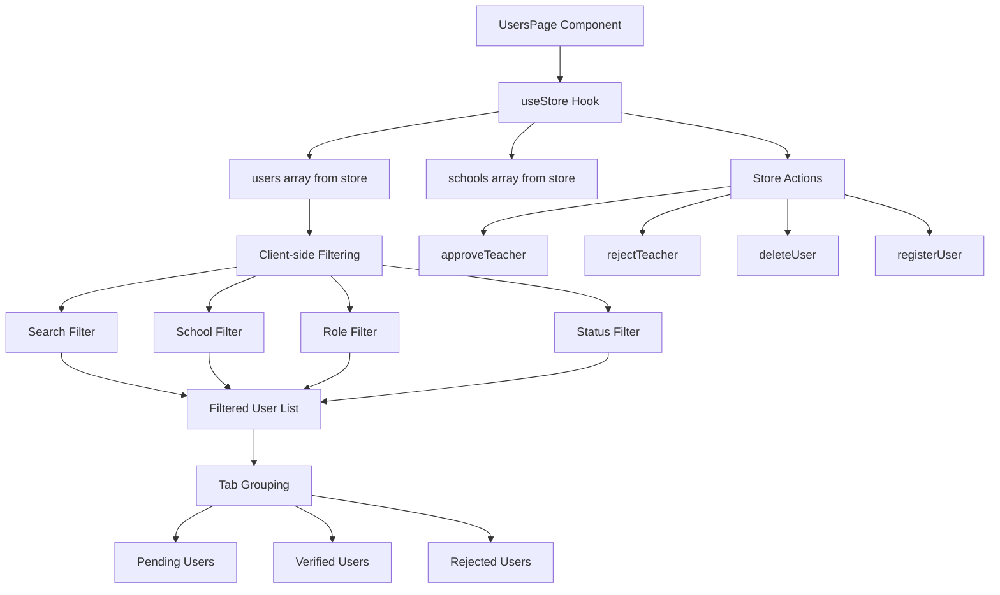

# Design Document: Superadmin Users View

## Overview

The Superadmin Users View feature provides a comprehensive, centralized interface for superadministrators to view, search, filter, and manage all user accounts across the entire Kindy Connect platform. This feature extends the existing user management functionality (currently available in the Teachers page) to provide superadmins with system-wide visibility and control.

### Context

The current system has role-based user management where:
- School admins and deputies can view and manage users within their assigned school
- Teachers have limited visibility
- Superadmins currently lack a dedicated view for system-wide user management

This feature fills that gap by creating a specialized view that leverages the superadmin role's system-wide permissions while maintaining the established patterns for user management, search, filtering, and approval workflows.

### Key Design Decisions

1. **Route Structure**: Following the established pattern (`/app/[feature]`), the new route will be `/app/users`
2. **Component Reuse**: Leveraging existing UI components (Card, Table, Dialog, Tabs, Badge) and patterns from `app.teachers.tsx`
3. **Data Access**: Using the existing `useStore()` hook which already provides filtered user lists based on role and school context
4. **State Management**: Client-side filtering and search using React state, consistent with existing pages
5. **Access Control**: Navigation menu conditional rendering and route-level permission checks

## Architecture

### Component Structure

```
app.users.tsx (Route Component)
├── UsersPage (Main Component)
│   ├── AppShell (Layout wrapper)
│   │   └── Card (Content container)
│   │       ├── CardHeader (Title, description, and Create User button)
│   │       ├── CardContent
│   │       │   ├── Search and Filter Controls
│   │       │   │   ├── Search Input (by ID, name, email)
│   │       │   │   ├── School Filter Dropdown
│   │       │   │   ├── Role Filter Dropdown
│   │       │   │   └── Status Filter Dropdown
│   │       │   └── Tabs (Status organization)
│   │       │       ├── Pending Tab → UserTable (with Approve/Reject actions)
│   │       │       ├── Verified Tab → UserTable (with Delete action)
│   │       │       └── Rejected Tab → UserTable (with Delete action)
│   │       └── CreateUserDialog (Modal form for user creation)
│   └── Unauthorized View (for non-superadmins)
```

### Data Flow



## Components and Interfaces

### Route Component

**File**: `src/routes/app.users.tsx`

**Responsibilities**:
- Define the route using TanStack Router's `createFileRoute`
- Set page metadata (title)
- Render the UsersPage component
- Handle route-level permissions

**Interface**:
```typescript
export const Route = createFileRoute("/app/users")({
  head: () => ({ meta: [{ title: "Users - Kindy Connect Admin" }] }),
  component: UsersPage,
});
```

### UsersPage Component

**Responsibilities**:
- Access control: verify superadmin role
- Manage local state for search query and filters
- Compose UI using child components
- Coordinate user actions (approve, reject, delete, create)
- Display loading and error states

**State Management**:
```typescript
interface UsersPageState {
  searchQuery: string;              // Search text for ID, name, email
  schoolFilter: string;             // "all" | school.id
  roleFilter: string;               // "all" | "super_admin" | "admin" | "deputy" | "teacher"
  statusFilter: string;             // "all" | "pending" | "verified" | "rejected"
  createDialogOpen: boolean;        // Dialog visibility
  createForm: CreateUserForm;       // Form state for new user
}

interface CreateUserForm {
  id: string;
  name: string;
  email: string;
  phone: string;
  role: Role;
  schoolId: string;
  password: string;
  subjects: string[];
}
```

### UserTable Component

**Responsibilities**:
- Render user data in tabular format
- Display user properties: ID, name, email, phone, role badge, school name, registration date, subjects
- Render action buttons based on user status and current user permissions
- Handle responsive column visibility

**Props**:
```typescript
interface UserTableProps {
  users: User[];
  schools: School[];
  currentUser: User;
  showApprovalActions: boolean;      // Show Approve/Reject buttons
  showDeleteAction: boolean;         // Show Delete button
  onApprove: (userId: string) => void;
  onReject: (userId: string) => void;
  onDelete: (userId: string) => void;
}
```

### CreateUserDialog Component

**Responsibilities**:
- Collect new user information via form inputs
- Validate form data
- Handle conditional fields (school for non-super_admin roles, subjects for teachers)
- Submit user creation request
- Display validation errors

**Props**:
```typescript
interface CreateUserDialogProps {
  open: boolean;
  onOpenChange: (open: boolean) => void;
  form: CreateUserForm;
  onFormChange: (form: CreateUserForm) => void;
  schools: School[];
  onSubmit: () => void;
}
```

### Navigation Menu Integration

**File**: `src/components/app-shell.tsx` (modification)

**Change**: Add conditional "Users" navigation link that displays only for superadmins

```typescript
{currentUser?.role === "super_admin" && (
  <Link to="/app/users" className="nav-link">
    Users
  </Link>
)}
```

## Data Models

### User Type (Existing)

```typescript
interface User {
  id: string;                        // Unique user identifier (e.g., "KC001")
  name: string;                      // Full name
  email: string;                     // Email address
  phone?: string;                    // Phone number
  role: Role;                        // User role
  status: TeacherStatus;             // Verification status
  registeredAt: string;              // ISO date string
  password?: string;                 // Plain text password (for admin viewing)
  schoolId?: string;                 // Associated school (undefined for super_admin)
  subjects?: string[];               // Assigned subjects (for teachers only)
  classId?: string;                  // Assigned class (for teachers)
}

type Role = "super_admin" | "admin" | "deputy" | "teacher";
type TeacherStatus = "pending" | "verified" | "rejected";
```

### School Type (Existing)

```typescript
interface School {
  id: string;                        // Unique school identifier
  name: string;                      // School name
  address?: string;                  // Physical address
  phone?: string;                    // Contact phone
  email?: string;                    // Contact email
  registeredAt: string;              // ISO date string
}
```

### Filter State Types

```typescript
type SchoolFilterValue = "all" | string;  // "all" or school.id
type RoleFilterValue = "all" | Role;
type StatusFilterValue = "all" | TeacherStatus;
```

## Correctness Properties

*Property-based testing is not appropriate for this feature. The Superadmin Users View is primarily a UI rendering and CRUD interface with the following characteristics:*

1. **UI Rendering**: The feature displays user data in tables, tabs, and forms - visual components that are best tested with snapshot tests and integration tests
2. **CRUD Operations**: User creation, approval, rejection, and deletion are database operations with side effects that should be tested with example-based unit tests and integration tests
3. **Filtering Logic**: While the filtering logic (search, role filter, school filter, status filter) could theoretically be property-tested, it is simple predicate-based filtering that is more efficiently verified with example-based tests covering key scenarios
4. **Access Control**: Permission checks are boolean conditions best verified with example-based tests for each role

**Alternative Testing Strategy**: See Testing Strategy section below for the recommended approach using unit tests, integration tests, and accessibility testing.

## Error Handling

### Client-Side Error Handling

**Access Control Errors**:
- **Condition**: User without `super_admin` role attempts to access `/app/users`
- **Handling**: Render "Unauthorized" view with message
- **User Feedback**: Display clear message explaining permission requirements

**Form Validation Errors**:
- **Condition**: Required fields empty, invalid email format, duplicate email
- **Handling**: Prevent form submission, highlight invalid fields
- **User Feedback**: Display toast notification with specific validation error

**Network Errors**:
- **Condition**: API call fails (approve, reject, delete, create operations)
- **Handling**: Display error toast with error message
- **User Feedback**: "Failed to [action] user: [error details]"

### Server-Side Error Handling

**Database Constraint Violations**:
- **Condition**: Duplicate email, invalid foreign key (schoolId)
- **Handling**: Return error response from server function
- **User Feedback**: Toast notification with specific error

**Authorization Failures**:
- **Condition**: Non-superadmin attempts server action
- **Handling**: Server function returns 403 error
- **User Feedback**: Toast notification: "You do not have permission to perform this action"

**Self-Deletion Prevention**:
- **Condition**: Superadmin attempts to delete their own account
- **Handling**: Client-side check disables delete button, server-side check rejects request
- **User Feedback**: Toast notification: "Cannot delete your own account"

### Error Recovery

1. **Retry Mechanism**: For network errors, display "Retry" button in error toast
2. **Data Refresh**: After error, automatically refresh data when page regains focus
3. **Form Persistence**: Keep form data in state after submission error so user can correct and resubmit
4. **Audit Logging**: Log all errors related to user management operations to audit_logs table

## Testing Strategy

### Unit Tests

**Component Tests** (using React Testing Library):

1. **UsersPage Access Control**:
   - Verify superadmin can view the page
   - Verify non-superadmin sees unauthorized message
   - Verify page title is set correctly

2. **Search Functionality**:
   - Search by user ID: partial match, case-insensitive
   - Search by name: partial match, case-insensitive
   - Search by email: partial match, case-insensitive
   - Empty search shows all users

3. **Filter Functionality**:
   - School filter: "all" shows all users, specific school shows only that school's users
   - Role filter: "all" shows all roles, specific role shows only that role
   - Status filter: applied by tab selection
   - Combined filters: all filters work simultaneously (AND logic)

4. **Tab Organization**:
   - Pending tab shows only pending users
   - Verified tab shows only verified users
   - Rejected tab shows only rejected users
   - Tab badges display correct counts

5. **User Actions**:
   - Approve button updates user status to "verified"
   - Reject button updates user status to "rejected"
   - Delete button shows confirmation dialog
   - Delete confirmation removes user from list
   - Cannot delete currently logged-in superadmin

6. **Create User Form**:
   - All required fields validated
   - Email format validated
   - Teacher role shows subjects selection
   - Super_admin role hides school selection
   - Form clears after successful submission

7. **User Display**:
   - All user properties displayed correctly
   - Role badges render with correct styling
   - School name displayed (not school ID)
   - Super_admin users show "(System-wide)" instead of school name
   - Registration date formatted correctly
   - Teacher subjects displayed

### Integration Tests

1. **Full User Approval Workflow**:
   - Create pending user
   - Approve user from Pending tab
   - Verify user moves to Verified tab
   - Verify audit log entry created

2. **Full User Rejection Workflow**:
   - Create pending user
   - Reject user from Pending tab
   - Verify user moves to Rejected tab
   - Verify audit log entry created

3. **User Creation Workflow**:
   - Open create dialog
   - Fill form with valid data
   - Submit form
   - Verify user appears in Verified tab
   - Verify audit log entry created

4. **User Deletion Workflow**:
   - Create verified user
   - Click delete button
   - Confirm deletion
   - Verify user removed from list
   - Verify audit log entry created

5. **Search and Filter Combination**:
   - Apply multiple filters simultaneously
   - Verify correct users displayed
   - Clear filters and verify all users shown

### Accessibility Tests

1. **Keyboard Navigation**:
   - Tab through all interactive elements
   - Verify focus indicators visible
   - Verify logical tab order

2. **Screen Reader Compatibility**:
   - Verify appropriate ARIA labels on form inputs
   - Verify table headers properly associated with cells
   - Verify button purposes clearly announced

3. **Color Contrast**:
   - Verify text meets WCAG AA standards (4.5:1 for normal text)
   - Verify interactive elements meet contrast requirements
   - Test with automated tools (axe, Lighthouse)

4. **Responsive Design**:
   - Test on desktop (1920px, 1440px, 1024px)
   - Test on tablet (768px)
   - Test on mobile (375px)
   - Verify table scrolls horizontally on small screens
   - Verify filters stack vertically on mobile

### Performance Tests

1. **Large User Lists**:
   - Test with 100+ users
   - Verify search/filter response time < 500ms
   - Verify pagination implemented if needed

2. **Cache Validation**:
   - Verify data cached for 30 seconds
   - Verify cache refreshes on focus
   - Verify manual refresh available

### Manual Testing Checklist

- [ ] Navigation link appears only for superadmins
- [ ] Non-superadmins redirected from `/app/users`
- [ ] All user properties display correctly
- [ ] Search works across ID, name, email
- [ ] School filter works correctly
- [ ] Role filter works correctly
- [ ] Status tabs work correctly
- [ ] All filters work in combination
- [ ] Approve action moves user to Verified tab
- [ ] Reject action moves user to Rejected tab
- [ ] Delete confirmation dialog appears
- [ ] Delete removes user and logs audit entry
- [ ] Cannot delete own account
- [ ] Create user dialog opens
- [ ] Create user form validates all fields
- [ ] Create user handles all roles correctly
- [ ] Teacher role shows subjects field
- [ ] Super_admin role hides school field
- [ ] Success/error toasts display correctly
- [ ] Loading states display during async operations
- [ ] Page responsive on all screen sizes
- [ ] Keyboard navigation works
- [ ] Screen reader announces elements correctly

## Implementation Notes

### File Organization

```
src/
├── routes/
│   ├── app.users.tsx               # New route component
│   ├── app.teachers.tsx            # Existing (reference for patterns)
│   └── ...
├── components/
│   ├── app-shell.tsx               # Modify to add Users nav link
│   └── ui/                         # Existing UI components (reuse)
└── lib/
    ├── mock-store.tsx              # Existing (no changes needed)
    └── db-functions.ts             # Existing (no changes needed)
```

### Dependencies

**Existing Dependencies** (no new packages required):
- `@tanstack/react-router` - Routing
- `@radix-ui/react-*` - UI primitives
- `lucide-react` - Icons
- `sonner` - Toast notifications
- `react-hook-form` + `zod` - Form handling (optional, can use controlled inputs)

### Code Reuse Opportunities

1. **Table Rendering**: Adapt `renderTable` function from `app.teachers.tsx`
2. **Form Dialog**: Adapt create user dialog pattern from `app.teachers.tsx`
3. **Filter Logic**: Adapt `useMemo` filtering pattern from `app.teachers.tsx`
4. **Action Handlers**: Reuse `approveTeacher`, `rejectTeacher`, `deleteUser` from store
5. **UI Components**: Reuse all existing UI components (Card, Table, Dialog, Tabs, Badge, Button, Input)

### Performance Considerations

1. **Memoization**: Use `useMemo` for filtered user lists to avoid re-filtering on every render
2. **Debouncing**: Consider debouncing search input if user list is very large (>500 users)
3. **Pagination**: Implement if user count exceeds 100 (as per Requirement 10.5)
4. **Virtual Scrolling**: Consider if user count exceeds 500 for smoother scrolling

### Responsive Design Breakpoints

- **Desktop**: 1024px and above - Full table with all columns
- **Tablet**: 768px - 1023px - Responsive table with horizontal scroll if needed
- **Mobile**: Below 768px - Stacked filters, horizontal scrollable table

### State Management Approach

**Local State** (useState):
- Search query
- School filter
- Role filter
- Create dialog open/closed
- Create form data

**Derived State** (useMemo):
- Filtered user list
- Pending users
- Verified users
- Rejected users

**Global State** (useStore):
- User data
- School data
- Current user
- Action handlers

This approach keeps filtering logic local and lightweight while leveraging the existing global store for data and actions.

### Audit Logging

All user management actions must log to the `audit_logs` table:

```typescript
interface AuditLogEntry {
  id: string;                    // Generated UUID
  actorId: string;               // Current user ID
  actorName: string;             // Current user name
  action: string;                // e.g., "Approved user", "Rejected user", "Deleted user", "Created user"
  target: string;                // User name and role being acted upon
  timestamp: string;             // ISO date string
}
```

**Actions to Log**:
- User approval: "Approved user" → "John Doe (teacher)"
- User rejection: "Rejected user" → "Jane Smith (deputy)"
- User deletion: "Deleted user" → "Bob Johnson (admin)"
- User creation: "Created user" → "Alice Brown (teacher)"

### Security Considerations

1. **Access Control**: Always verify `currentUser.role === "super_admin"` before rendering content
2. **Self-Deletion Prevention**: Disable delete button for current user, add server-side check
3. **Email Uniqueness**: Validate email uniqueness before user creation
4. **Password Handling**: Passwords stored in plain text (per existing system design) but only visible to superadmins
5. **XSS Prevention**: All user input sanitized by React's default behavior (no dangerouslySetInnerHTML)

### Accessibility Requirements

1. **Semantic HTML**: Use `<table>`, `<th>`, `<td>` for tabular data
2. **Form Labels**: All form inputs must have associated `<label>` elements
3. **Button Purpose**: All buttons must have clear, descriptive text or aria-label
4. **Focus Management**: Dialog should trap focus and return focus on close
5. **Error Announcements**: Form errors should be announced to screen readers
6. **Keyboard Support**: All interactive elements accessible via keyboard
7. **Color Contrast**: Minimum 4.5:1 for normal text, 3:1 for large text and UI components

## Migration and Deployment

### Pre-Deployment Checklist

- [ ] Route file created: `src/routes/app.users.tsx`
- [ ] Navigation menu updated: `src/components/app-shell.tsx`
- [ ] Unit tests written and passing
- [ ] Integration tests written and passing
- [ ] Accessibility audit completed (axe, Lighthouse)
- [ ] Manual testing checklist completed
- [ ] Responsive design tested on all breakpoints
- [ ] Error handling tested (network errors, validation errors)
- [ ] Performance tested with large user lists
- [ ] Code review completed
- [ ] Documentation updated

### Rollback Plan

If issues arise post-deployment:
1. Remove navigation link from `app-shell.tsx` (makes feature inaccessible)
2. Delete route file `app.users.tsx` if necessary
3. No database migrations required (uses existing schema)
4. No data loss risk (feature only reads/writes existing tables)

### Monitoring

**Metrics to Track**:
- Page load time for `/app/users`
- Search/filter response time
- User action success/failure rates (approve, reject, delete, create)
- Error rates from server functions
- Usage statistics: number of superadmin visits to users view

**Logging**:
- All user management actions logged to `audit_logs` table
- Client-side errors logged to console
- Server-side errors logged with error capture utility

## Future Enhancements

**Potential Future Improvements** (not in scope for initial release):

1. **Bulk Actions**: Select multiple users for bulk approval/rejection/deletion
2. **Export Functionality**: Export user list to CSV/Excel
3. **Advanced Filters**: Date range filter, multiple school selection, multiple role selection
4. **User Details Modal**: Click user row to view detailed profile in modal
5. **Inline Editing**: Edit user details directly in the table
6. **Activity History**: View approval/rejection/deletion history per user
7. **Email Notifications**: Send email to user when approved/rejected
8. **Password Reset**: Allow superadmin to reset user password
9. **Account Deactivation**: Soft delete option that preserves audit trail
10. **Search Autocomplete**: Suggestions while typing in search field

These enhancements can be considered for future iterations based on user feedback and usage patterns.
